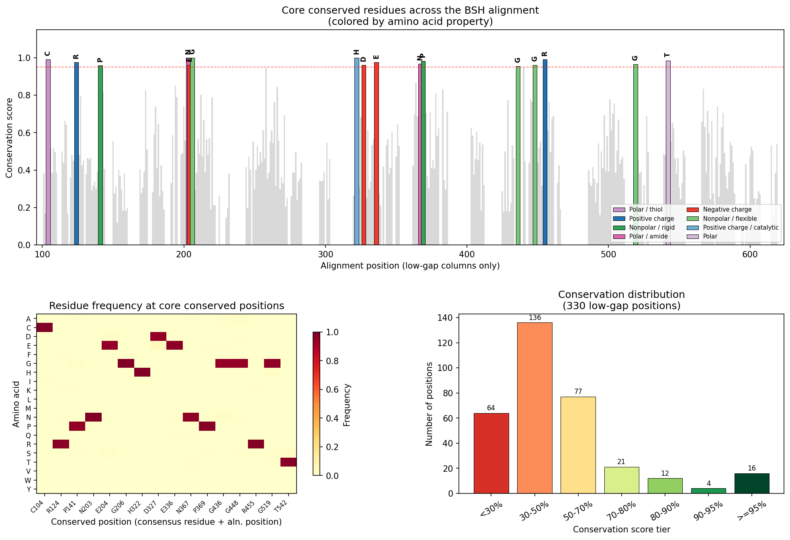
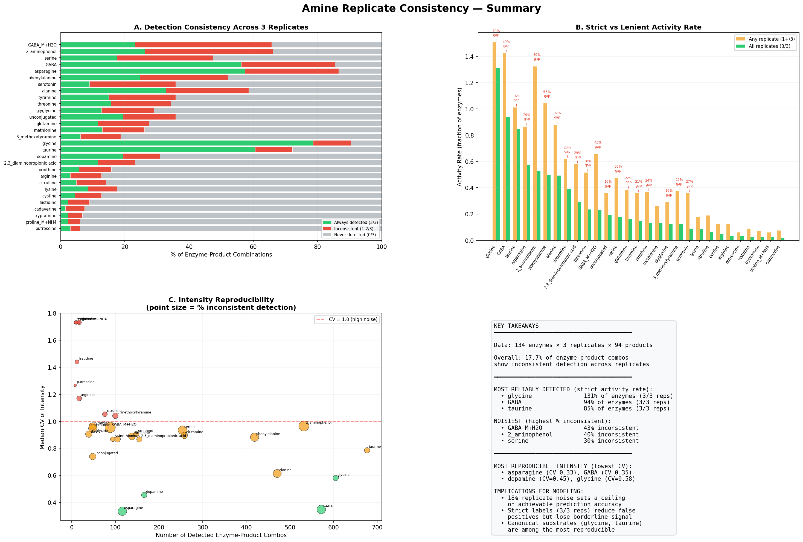
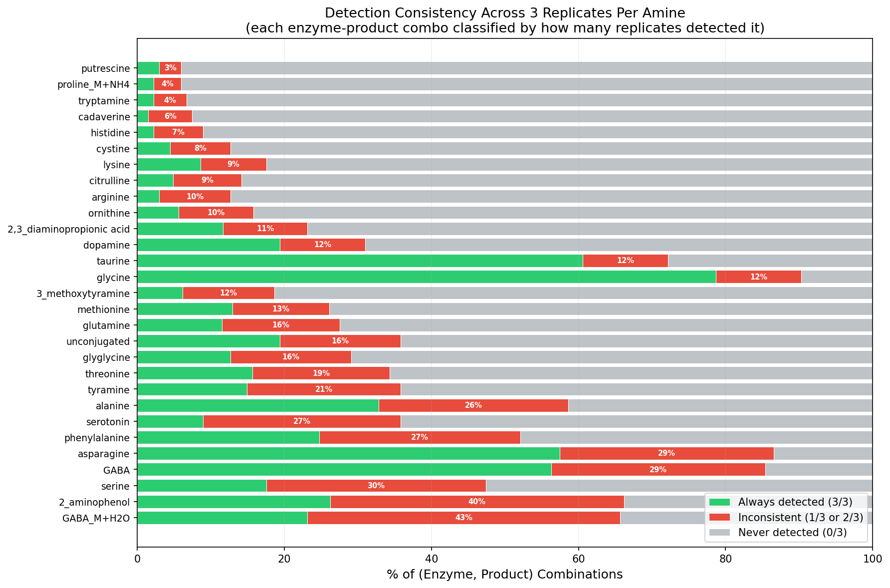
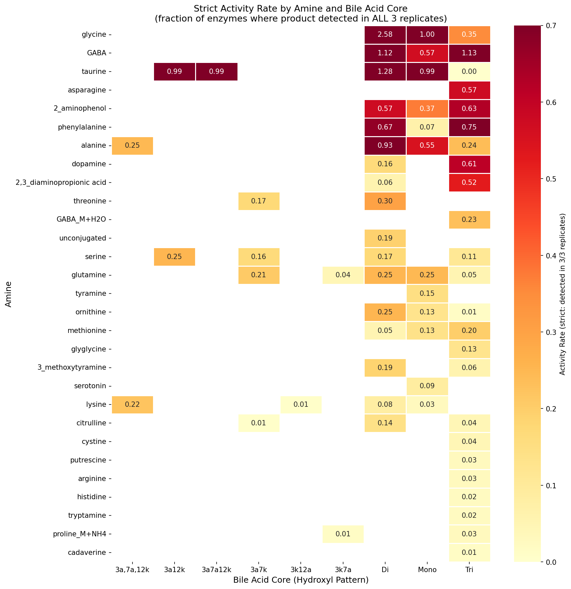
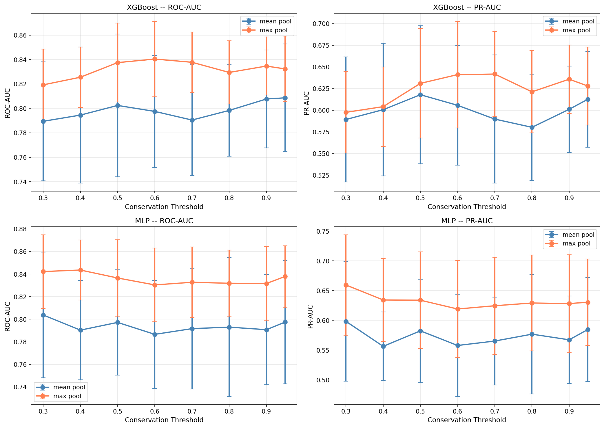
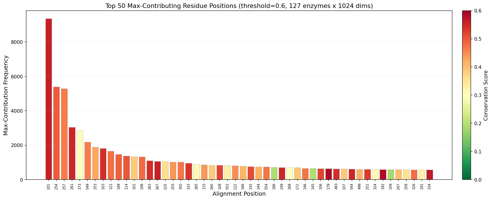

# BSH Conjugation Model

Predicting bile salt hydrolase (BSH) enzyme activity on bile acid-amine conjugation pairs using machine learning.

## Background

Bile salt hydrolases (BSH) are microbial enzymes that deconjugate bile acid-amine conjugates in the gut. The Lukowski and Dorrestein labs screened a panel of BSH enzymes against combinations of bile acids and amines to identify which enzymes can catalyze novel conjugation reactions. Product formation was measured by LC-MS intensity across 3 experimental replicates.

This repository contains the data analysis pipeline, replicate quality assessment, and feature engineering for predicting BSH conjugation activity from:

- **Enzyme embeddings** (ProtT5 protein language model, per-residue)
- **Conservation-guided residue selection** (non-conserved positions from MSA)
- **Amine molecular representations** (physicochemical descriptors, one-hot, MolT5)

## Sequence Alignment & Conservation

The notebook `notebooks/bsh_alignment_conservation.ipynb` aligns all 127 BSH sequences with MUSCLE and identifies conserved vs variable positions across the family.

Out of 330 well-occupied alignment columns, only **16 positions are >=95% conserved** -- the catalytic and structural core of the BSH family:

- **C** (Cys) -- catalytic nucleophile
- **H** (His), **D** (Asp) -- complete the Ntn-hydrolase catalytic triad
- **E** (Glu x2), **R** (Arg x2), **N** (Asn x2) -- active site / substrate binding
- **G** (Gly x4), **P** (Pro x2), **T** (Thr) -- structural flexibility and turns

The remaining ~95% of positions are variable, representing the sequence diversity that drives differences in substrate specificity across BSH enzymes.



## Replicate Consistency Analysis

Before building predictive models, we assessed the quality and reproducibility of the LC-MS measurements across 3 experimental replicates (134 enzymes x 94 products).



**Key findings:**
- **GABA** and **asparagine** are the most reliably detected novel amine conjugates (low CV, high detection consistency)
- **2-aminophenol** (40% inconsistent) and **GABA_M+H2O** (43%) are the noisiest -- product appears in only 1-2 of 3 replicates
- **Glycine** and **taurine** (canonical substrates) are among the most reproducible signals
- The gap between "any replicate" vs "all 3 replicates" activity rate reveals which amines have borderline detection





See `notebooks/amine_replicate_consistency.ipynb` and `notebooks/replicate_consistency_analysis.ipynb` for full analysis.

## Conservation Threshold Sweep & Max-Pooling Analysis

We tested 8 conservation thresholds x 2 pooling strategies (mean vs max) x 2 models (XGBoost, MLP) x 10 enzyme hold-out seeds = 320 experiments to optimize the enzyme representation.



**Key findings:**
- **Max pooling consistently outperforms mean pooling** at every threshold (ROC-AUC gap of 0.03-0.05)
- **Threshold 0.6 with max pooling** is the optimal configuration for XGBoost (ROC-AUC: 0.840, PR-AUC: 0.641)
- The max-pool advantage grows with more residues (dilution effect on mean pooling)
- A small set of ~10 alignment positions dominate the max-pool signal -- likely binding pocket residues



The top max-contributing position (alignment position 201) accounts for 7.2% of all max contributions across 1024 embedding dimensions, suggesting these positions are functionally important for substrate specificity.

See `notebooks/conservation_threshold_sweep.ipynb` for full analysis.

## Repository Structure

```
BSH_model/
├── README.md
├── requirements.txt
├── .gitignore
├── data/                              # Input data files
│   ├── NEW_Stage2_BAs_amines_for_heatmap_manual.csv  # LC-MS intensities: amine products (3 reps)
│   ├── NEW_Stage2_BAs_subs_for_heatmap_manual.csv    # LC-MS intensities: substrate products (3 reps)
│   ├── Seqs_list_total.fasta                         # 127 BSH protein sequences
│   ├── Seqs_list_total.h5                            # ProtT5 whole-protein embeddings
│   ├── bsh_reactants_SMILES_corrected.xlsx           # Corrected reactant SMILES
│   ├── molt5_base_amine_embeddings.csv               # MolT5-base amine embeddings (768-dim)
│   ├── molt5_small_amine_embeddings.csv              # MolT5-small amine embeddings
│   └── swap_enumeration_with_core_smiles.xlsx        # Enumeration with core SMILES
├── notebooks/                         # Analysis notebooks
│   ├── data_preprocessing_BSH_enzyme_model.ipynb     # Data preprocessing pipeline
│   ├── bsh_alignment_conservation.ipynb              # Sequence alignment & conservation
│   ├── replicate_consistency_analysis.ipynb           # Replicate quality assessment
│   ├── amine_replicate_consistency.ipynb              # Per-amine detection consistency
│   ├── amine_activity_analysis.ipynb                  # Amine activity profiling
│   ├── amine_representation_comparison.ipynb          # Amine feature comparison
│   ├── molt5_amine_representation.ipynb               # MolT5 molecular embeddings
│   ├── bsh_nonconserved_residue_model.ipynb           # Non-conserved residue model
│   ├── enzyme_amine_combination.ipynb                 # Enzyme + amine representation sweep
│   ├── conservation_threshold_sweep.ipynb             # Conservation threshold optimization
│   ├── bile_acid_hydroxylation_model.ipynb            # Bile acid core analysis
│   ├── bsh_amine_prediction_model.ipynb               # Prediction model notebook
│   ├── amine_umap_explorer.ipynb                      # UMAP visualization
│   └── BSH_conjugation_model.ipynb                    # MIL model training notebook
├── images/                            # Figures for documentation
├── training/                          # Standalone training scripts
└── outputs/                           # Generated by notebooks (gitignored)
```

## Setup

```bash
pip install -r requirements.txt
```

For the alignment notebook, [MUSCLE](https://drive5.com/muscle/) must also be installed and available as `./muscle` in the project root (or on your PATH). On macOS: `brew install brewsci/bio/muscle`.

## Data Files

| File | Description |
|------|-------------|
| `NEW_Stage2_BAs_amines_for_heatmap_manual.csv` | LC-MS intensity for 82 amine products across 134 enzymes x 3 replicates |
| `NEW_Stage2_BAs_subs_for_heatmap_manual.csv` | LC-MS intensity for 12 substrate products (taurine/glycine conjugates) |
| `bsh_reactants_SMILES_corrected.xlsx` | Corrected reactant SMILES for bile acids and amines |
| `Seqs_list_total.fasta` | 127 BSH protein sequences |
| `Seqs_list_total.h5` | ProtT5 whole-protein embeddings |
| `molt5_base_amine_embeddings.csv` | MolT5-base molecular embeddings for amines (768-dim) |
| `molt5_small_amine_embeddings.csv` | MolT5-small molecular embeddings for amines |
| `swap_enumeration_with_core_smiles.xlsx` | Pre-computed enumeration with core SMILES annotations |

## Key Results

The best-performing model uses a **regularized XGBoost classifier** (max_depth=3, reg_alpha=1.0, reg_lambda=5.0, subsample=0.7) evaluated with **enzyme hold-out cross-validation** (10 random splits, 80/20 train/test) to ensure generalization to unseen enzymes.

**Model input features (1065-dim):**
- **Enzyme (1024-dim):** ProtT5 per-residue embeddings at non-conserved alignment positions (conservation score < 0.6), max-pooled across selected residues. Non-conserved positions are identified from a multiple sequence alignment of all 127 BSH sequences -- these variable positions capture the sequence diversity that drives substrate specificity differences.
- **Amine (41-dim):** 15 RDKit physicochemical descriptors (molecular weight, LogP, TPSA, H-bond donors/acceptors, rotatable bonds, aromatic rings, etc.) + 26-dim one-hot encoding of amine identity. This compact representation outperformed both Morgan fingerprints (1024-dim) and MolT5 molecular language model embeddings (768-dim), likely because the smaller feature space reduces overfitting given the limited training data.

**Prediction target:** Binary classification of whether an enzyme-amine pair produces a detectable deconjugation product (active_approach2 label, aggregated across bile acid cores with max).

| Metric | Value |
|--------|-------|
| ROC-AUC | 0.840 +/- 0.031 |
| PR-AUC | 0.641 +/- 0.061 |
| F1 Score | 0.615 +/- 0.036 |
| Feature importance | 94% enzyme / 6% amine |
| Replicate noise ceiling | ~15% of enzyme-product combos show inconsistent detection across 3 reps |

**Key findings from representation analysis:**
- Max pooling outperforms mean pooling at every conservation threshold (ROC-AUC gap of 0.03-0.05), because a small set of ~10 residue positions dominate the max-pool signal
- The enzyme embedding drives 94% of the model's predictions, while amine features contribute 6% -- suggesting that enzyme identity is far more predictive than amine chemistry
- Compact amine representations (41-dim) reduce overfitting compared to sparse fingerprints (1024-dim), as seen in smaller train-validation log loss gaps
