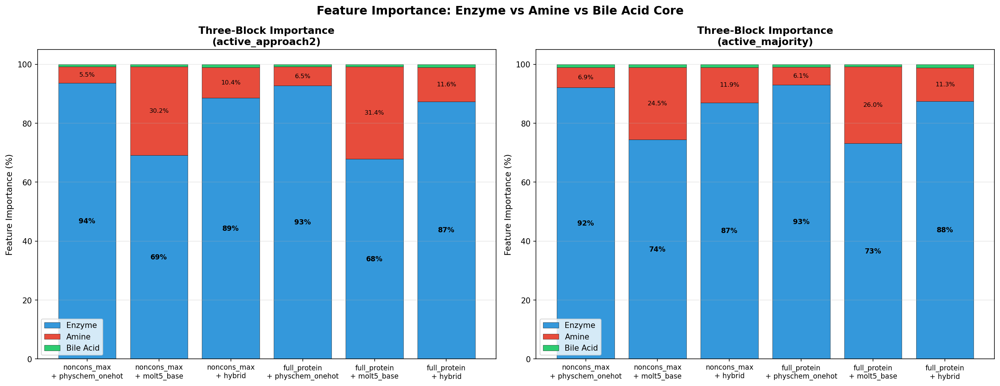
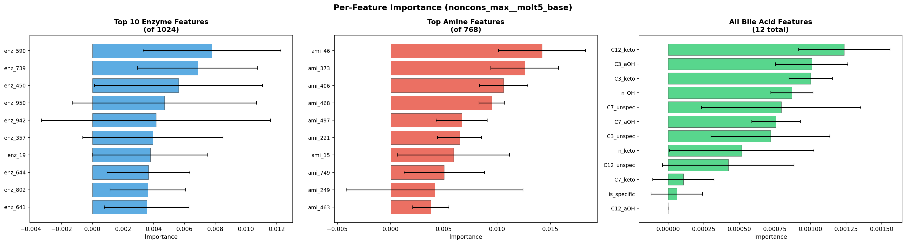
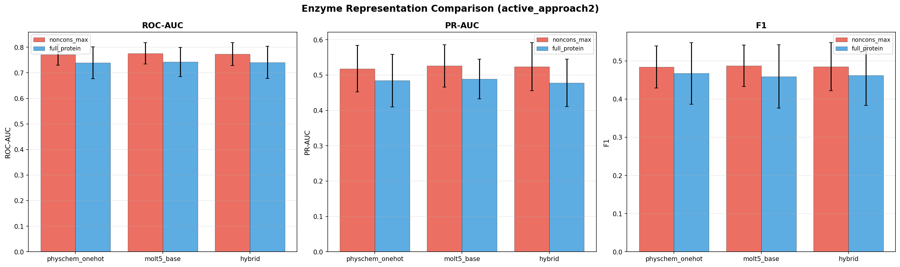
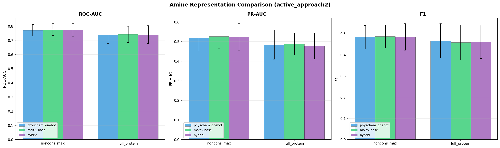
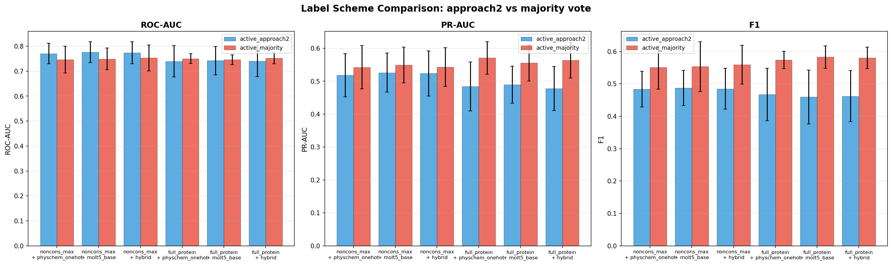
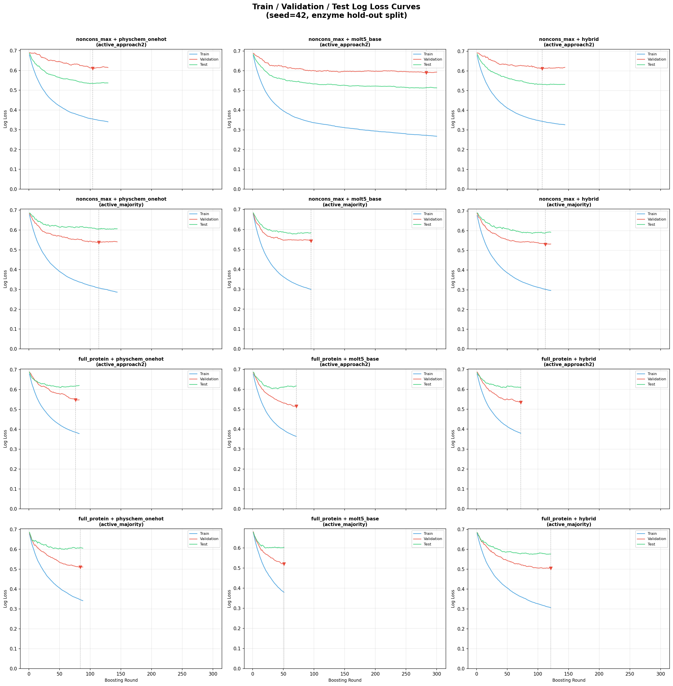
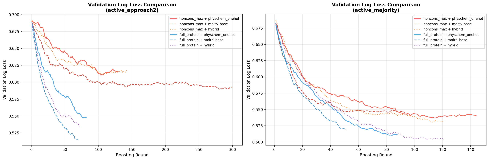
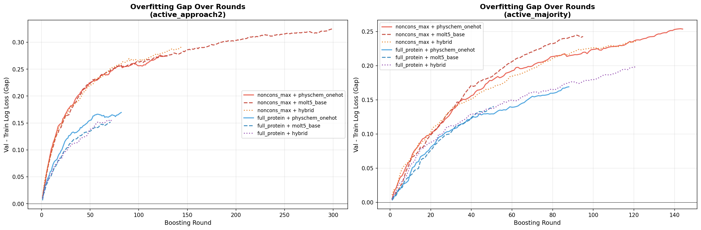

# BSH Conjugation Model

Predicting bile salt hydrolase (BSH) enzyme activity on bile acid-amine conjugation pairs using machine learning.

## Background

Bile salt hydrolases (BSH) are microbial enzymes that deconjugate bile acid-amine conjugates in the gut. The Lukowski and Dorrestein labs screened a panel of BSH enzymes against combinations of bile acids and amines to identify which enzymes can catalyze novel conjugation reactions. Product formation was measured by LC-MS intensity across 3 experimental replicates.

This repository contains the data analysis pipeline, replicate quality assessment, and feature engineering for predicting BSH conjugation activity from:

- **Enzyme embeddings** (ProtT5 protein language model, per-residue)
- **Conservation-guided residue selection** (non-conserved positions from MSA)
- **Amine molecular representations** (physicochemical descriptors, one-hot, MolT5)

## Sequence Alignment & Conservation

The notebook `notebooks/bsh_alignment_conservation.ipynb` aligns all 127 BSH sequences with MUSCLE and identifies conserved vs variable positions across the family.

Out of 330 well-occupied alignment columns, only **16 positions are >=95% conserved** -- the catalytic and structural core of the BSH family:

- **C** (Cys) -- catalytic nucleophile
- **H** (His), **D** (Asp) -- complete the Ntn-hydrolase catalytic triad
- **E** (Glu x2), **R** (Arg x2), **N** (Asn x2) -- active site / substrate binding
- **G** (Gly x4), **P** (Pro x2), **T** (Thr) -- structural flexibility and turns

The remaining ~95% of positions are variable, representing the sequence diversity that drives differences in substrate specificity across BSH enzymes.


## Replicate Consistency Analysis

Before building predictive models, we assessed the quality and reproducibility of the LC-MS measurements across 3 experimental replicates (134 enzymes x 94 products).


**Key findings:**
- **GABA** and **asparagine** are the most reliably detected novel amine conjugates (low CV, high detection consistency)
- **2-aminophenol** (40% inconsistent) and **GABA_M+H2O** (43%) are the noisiest -- product appears in only 1-2 of 3 replicates
- **Glycine** and **taurine** (canonical substrates) are among the most reproducible signals
- The gap between "any replicate" vs "all 3 replicates" activity rate reveals which amines have borderline detection


See `notebooks/amine_replicate_consistency.ipynb` and `notebooks/replicate_consistency_analysis.ipynb` for full analysis.

## Conservation Threshold Sweep & Max-Pooling Analysis

We tested 8 conservation thresholds x 2 pooling strategies (mean vs max) x 2 models (XGBoost, MLP) x 10 enzyme hold-out seeds = 320 experiments to optimize the enzyme representation.


**Key findings:**
- **Max pooling consistently outperforms mean pooling** at every threshold (ROC-AUC gap of 0.03-0.05)
- **Threshold 0.6 with max pooling** is the optimal configuration for XGBoost (ROC-AUC: 0.840, PR-AUC: 0.641)
- The max-pool advantage grows with more residues (dilution effect on mean pooling)
- A small set of ~10 alignment positions dominate the max-pool signal -- likely binding pocket residues


The top max-contributing position (alignment position 201) accounts for 7.2% of all max contributions across 1024 embedding dimensions, suggesting these positions are functionally important for substrate specificity.

See `notebooks/conservation_threshold_sweep.ipynb` for full analysis.

## Product-Level Model: Enzyme + Amine + Bile Acid Core

The earlier models collapsed bile acid hydroxylation patterns (Mono/Di/Tri and positional variants like 3a7k, 3k12a) into a single enzyme-amine pair by aggregating across all bile acid substrates. The **product-level model** (`notebooks/bsh_product_level_model.ipynb`) preserves this hydroxylation specificity, treating each **(Enzyme, Amine, Hydroxylation pattern)** triple as a separate sample.

### Three Feature Blocks

Each sample is represented by three concatenated feature blocks:

| Block | Dimensions | Source | Description |
|-------|-----------|--------|-------------|
| **Enzyme** | 1024 | ProtT5 per-residue embeddings | Two variants tested: `noncons_max` (conservation-guided, non-conserved positions max-pooled) and `full_protein` (mean-pooled whole sequence) |
| **Amine** | 41 / 768 / 91 | RDKit / MolT5 / hybrid | Three variants: `physchem_onehot` (15 physicochemical descriptors + one-hot), `molt5_base` (MolT5 language model, 768-dim), `hybrid` (physchem_onehot + PCA-50 of MolT5) |
| **Bile Acid Core** | 12 | Positional encoding | C3/C7/C12 hydroxylation status (alpha-OH, keto, or unspecified) + hydroxyl count + keto count + is_specific flag |

### Two Label Schemes

Two different approaches were used to define "active" enzyme-amine-hydroxylation triples:

- **`active_approach2` (median-based):** A product is active if its LC-MS intensity exceeds a per-amine epsilon threshold (1000 intensity units) after excluding canonical conjugates (taurine, glycine). This approach was used in all earlier models and captures any detectable signal above noise.

- **`active_majority` (replicate-aware, new):** A product is active only if it was detected in **at least 2 of 3 experimental replicates**. This is more conservative and filters out sporadic/irreproducible detections. Where replicate data was unavailable, the approach2 label was used as fallback. The two schemes disagree on ~X% of samples, with majority vote being stricter.

### Experiment Grid

**120 total experiments:** 2 enzyme representations x 3 amine representations x 2 label schemes x 10 random seeds = 120 models, all evaluated with **enzyme hold-out cross-validation** (stratified 64/16/20 train/val/test split by enzyme activity profile).

**XGBoost configuration:** n_estimators=300, max_depth=3, learning_rate=0.05, reg_alpha=1.0, reg_lambda=5.0, subsample=0.7, colsample_bytree=0.7, min_child_weight=5, early_stopping_rounds=30, scale_pos_weight=auto.

### Results Summary

#### active_approach2 (median-based labels)

| Rank | Enzyme | Amine | Dims | ROC-AUC | PR-AUC | LL Gap |
|------|--------|-------|------|---------|--------|--------|
| 1 | noncons_max | molt5_base | 1804 | 0.776 +/- 0.042 | 0.526 +/- 0.060 | +0.191 |
| 2 | noncons_max | hybrid | 1093 | 0.774 +/- 0.045 | 0.524 +/- 0.068 | +0.182 |
| 3 | noncons_max | physchem_onehot | 1072 | 0.771 +/- 0.041 | 0.518 +/- 0.066 | +0.182 |
| 4 | full_protein | molt5_base | 1804 | 0.742 +/- 0.057 | 0.489 +/- 0.056 | +0.176 |
| 5 | full_protein | physchem_onehot | 1072 | 0.739 +/- 0.063 | 0.484 +/- 0.074 | +0.177 |
| 6 | full_protein | hybrid | 1093 | 0.741 +/- 0.063 | 0.478 +/- 0.067 | +0.180 |

#### active_majority (replicate-aware labels)

| Rank | Enzyme | Amine | Dims | ROC-AUC | PR-AUC | LL Gap |
|------|--------|-------|------|---------|--------|--------|
| 1 | noncons_max | hybrid | 1093 | 0.753 +/- 0.052 | 0.543 +/- 0.059 | +0.232 |
| 2 | full_protein | hybrid | 1093 | 0.752 +/- 0.022 | 0.563 +/- 0.054 | +0.248 |
| 3 | full_protein | physchem_onehot | 1072 | 0.750 +/- 0.019 | 0.571 +/- 0.050 | +0.232 |
| 4 | full_protein | molt5_base | 1804 | 0.746 +/- 0.020 | 0.555 +/- 0.055 | +0.209 |
| 5 | noncons_max | molt5_base | 1804 | 0.749 +/- 0.044 | 0.549 +/- 0.054 | +0.229 |
| 6 | noncons_max | physchem_onehot | 1072 | 0.747 +/- 0.054 | 0.542 +/- 0.066 | +0.223 |

### Feature Importance: Three-Block Analysis

Across all configurations, **enzyme features dominate** (68-94% of total importance), amine features contribute 5-31%, and bile acid core features contribute only 1-2%.



The bile acid positional encoding adds minimal discriminative power -- C12_keto and C3_aOH are the most important bile acid features, but their absolute contribution is small. This suggests that hydroxylation pattern alone does not strongly predict activity beyond what enzyme and amine identity already capture.



### Representation Comparisons

**Enzyme representations:** `noncons_max` (conservation-guided) consistently outperforms `full_protein` on ROC-AUC with approach2 labels, confirming that filtering to non-conserved residues removes noise from the conserved structural core. However, with majority labels, the gap narrows.



**Amine representations:** All three (physchem_onehot, molt5_base, hybrid) perform comparably. MolT5-base has a marginal edge on PR-AUC, but the differences are within standard deviation. The 768-dim MolT5 embeddings do not meaningfully outperform the 41-dim physicochemical+onehot representation.



**Label scheme comparison:** The `active_majority` labels yield higher PR-AUC and F1 than `active_approach2`, suggesting the replicate-aware labels reduce noise and make the classification task slightly more learnable. However, they also show larger log loss gaps (more overfitting).



### Log Loss Curves & Overfitting Analysis

The raw train/val/test log loss curves reveal the learning dynamics across all configurations:



**Key observations:**
- Training loss steadily decreases while validation loss plateaus early, indicating the model exhausts learnable signal quickly
- `full_protein` configs trigger early stopping sooner (51-88 rounds) vs `noncons_max` (95-300 rounds), suggesting the full protein embedding has less extractable signal
- `noncons_max + molt5_base` (approach2) runs all 300 rounds without early stopping, accumulating the largest overfitting gap



The validation curves show `full_protein` combos reaching lower absolute validation loss despite worse test set metrics -- a sign of distribution shift between validation and test enzymes in the hold-out splits.



The train-val gap grows approximately linearly with boosting rounds across all configurations, with no configuration showing signs of convergence. This monotonic gap growth is a hallmark of a model that is memorizing training patterns rather than learning generalizable features.

### Assessment & Current Limitations

**Performance plateau:** The product-level model (ROC-AUC ~0.74-0.78, PR-AUC ~0.48-0.57) shows a **notable drop** from the earlier pair-level model (ROC-AUC 0.84, PR-AUC 0.64). This is expected -- predicting activity at the individual hydroxylation pattern level is a harder task with more samples but sparser positive labels.

**What the log loss curves tell us:**
1. **The model learns fast then overfits.** Most useful signal is extracted in the first 50-80 rounds. After that, additional rounds only memorize training noise.
2. **The overfitting gap never stabilizes.** In a well-calibrated model, you'd expect the gap to plateau. Here it grows linearly, meaning the regularization (L1/L2, subsampling, early stopping) is slowing but not preventing overfitting.
3. **Representations make marginal differences.** Swapping enzyme or amine representations shifts metrics by ~0.03 ROC-AUC at most. This suggests the bottleneck is not in feature engineering but in the fundamental signal-to-noise ratio of the data.

**Likely root causes:**
- **Dataset size vs dimensionality:** With ~8,000 product-level samples and 1024+ features, the model is in a high-dimensional regime where XGBoost can easily overfit. The enzyme hold-out evaluation makes this harder since the model must generalize to entirely unseen protein sequences.
- **Bile acid core adds little.** The 12-dim hydroxylation encoding contributes only 1-2% feature importance. This could mean (a) hydroxylation specificity is genuinely driven by enzyme identity rather than the bile acid pattern itself, or (b) the positional encoding doesn't capture the right chemical information about bile acid structure.
- **Label noise ceiling.** With ~15% of enzyme-product combinations showing inconsistent detection across replicates, there is a hard noise floor that limits achievable performance. The majority-vote labels help but don't eliminate this.

**Potential next directions:**
- **Dimensionality reduction on enzyme embeddings** (PCA to 50-100 dims) to reduce the feature-to-sample ratio
- **Neural network architectures** (attention-based or graph neural networks) that can learn non-linear enzyme-amine-bile acid interactions
- **Data augmentation** through replicate-level training instead of aggregated labels
- **Incorporating 3D structural information** about the bile acid binding pocket rather than sequence-only features
- **Transfer learning** from larger protein-ligand interaction datasets before fine-tuning on BSH-specific data

## Repository Structure

```
BSH_model/
├── README.md
├── requirements.txt
├── .gitignore
├── data/                              # Input data files
│   ├── NEW_Stage2_BAs_amines_for_heatmap_manual.csv  # LC-MS intensities: amine products (3 reps)
│   ├── NEW_Stage2_BAs_subs_for_heatmap_manual.csv    # LC-MS intensities: substrate products (3 reps)
│   ├── Seqs_list_total.fasta                         # 127 BSH protein sequences
│   ├── Seqs_list_total.h5                            # ProtT5 whole-protein embeddings
│   ├── bsh_reactants_SMILES_corrected.xlsx           # Corrected reactant SMILES
│   ├── molt5_base_amine_embeddings.csv               # MolT5-base amine embeddings (768-dim)
│   ├── molt5_small_amine_embeddings.csv              # MolT5-small amine embeddings
│   └── swap_enumeration_with_core_smiles.xlsx        # Enumeration with core SMILES
├── notebooks/                         # Analysis notebooks
│   ├── data_preprocessing_BSH_enzyme_model.ipynb     # Data preprocessing pipeline
│   ├── bsh_alignment_conservation.ipynb              # Sequence alignment & conservation
│   ├── replicate_consistency_analysis.ipynb           # Replicate quality assessment
│   ├── amine_replicate_consistency.ipynb              # Per-amine detection consistency
│   ├── amine_activity_analysis.ipynb                  # Amine activity profiling
│   ├── amine_representation_comparison.ipynb          # Amine feature comparison
│   ├── molt5_amine_representation.ipynb               # MolT5 molecular embeddings
│   ├── bsh_nonconserved_residue_model.ipynb           # Non-conserved residue model
│   ├── enzyme_amine_combination.ipynb                 # Enzyme + amine representation sweep
│   ├── conservation_threshold_sweep.ipynb             # Conservation threshold optimization
│   ├── bile_acid_hydroxylation_model.ipynb            # Bile acid core analysis
│   ├── bsh_amine_prediction_model.ipynb               # Prediction model notebook
│   ├── bsh_product_level_model.ipynb                   # Product-level model (enzyme + amine + bile acid)
│   ├── plot_logloss_curves.py                          # Log loss curve analysis script
│   ├── amine_umap_explorer.ipynb                      # UMAP visualization
│   └── BSH_conjugation_model.ipynb                    # MIL model training notebook
├── images/                            # Figures for documentation
├── training/                          # Standalone training scripts
└── outputs/                           # Generated by notebooks (gitignored)
```

## Setup

```bash
pip install -r requirements.txt
```

For the alignment notebook, [MUSCLE](https://drive5.com/muscle/) must also be installed and available as `./muscle` in the project root (or on your PATH). On macOS: `brew install brewsci/bio/muscle`.

## Data Files

| File | Description |
|------|-------------|
| `NEW_Stage2_BAs_amines_for_heatmap_manual.csv` | LC-MS intensity for 82 amine products across 134 enzymes x 3 replicates |
| `NEW_Stage2_BAs_subs_for_heatmap_manual.csv` | LC-MS intensity for 12 substrate products (taurine/glycine conjugates) |
| `bsh_reactants_SMILES_corrected.xlsx` | Corrected reactant SMILES for bile acids and amines |
| `Seqs_list_total.fasta` | 127 BSH protein sequences |
| `Seqs_list_total.h5` | ProtT5 whole-protein embeddings |
| `molt5_base_amine_embeddings.csv` | MolT5-base molecular embeddings for amines (768-dim) |
| `molt5_small_amine_embeddings.csv` | MolT5-small molecular embeddings for amines |
| `swap_enumeration_with_core_smiles.xlsx` | Pre-computed enumeration with core SMILES annotations |

## Key Results

The best-performing model uses a **regularized XGBoost classifier** (max_depth=3, reg_alpha=1.0, reg_lambda=5.0, subsample=0.7) evaluated with **enzyme hold-out cross-validation** (10 random splits, 80/20 train/test) to ensure generalization to unseen enzymes.

**Model input features (1065-dim):**
- **Enzyme (1024-dim):** ProtT5 per-residue embeddings at non-conserved alignment positions (conservation score < 0.6), max-pooled across selected residues. Non-conserved positions are identified from a multiple sequence alignment of all 127 BSH sequences -- these variable positions capture the sequence diversity that drives substrate specificity differences.
- **Amine (41-dim):** 15 RDKit physicochemical descriptors (molecular weight, LogP, TPSA, H-bond donors/acceptors, rotatable bonds, aromatic rings, etc.) + 26-dim one-hot encoding of amine identity. This compact representation outperformed both Morgan fingerprints (1024-dim) and MolT5 molecular language model embeddings (768-dim), likely because the smaller feature space reduces overfitting given the limited training data.

**Prediction target:** Binary classification of whether an enzyme-amine pair produces a detectable deconjugation product (active_approach2 label, aggregated across bile acid cores with max).

| Metric | Value |
|--------|-------|
| ROC-AUC | 0.840 +/- 0.031 |
| PR-AUC | 0.641 +/- 0.061 |
| F1 Score | 0.615 +/- 0.036 |
| Feature importance | 94% enzyme / 6% amine |
| Replicate noise ceiling | ~15% of enzyme-product combos show inconsistent detection across 3 reps |

**Key findings from representation analysis:**
- Max pooling outperforms mean pooling at every conservation threshold (ROC-AUC gap of 0.03-0.05), because a small set of ~10 residue positions dominate the max-pool signal
- The enzyme embedding drives 94% of the model's predictions, while amine features contribute 6% -- suggesting that enzyme identity is far more predictive than amine chemistry
- Compact amine representations (41-dim) reduce overfitting compared to sparse fingerprints (1024-dim), as seen in smaller train-validation log loss gaps
